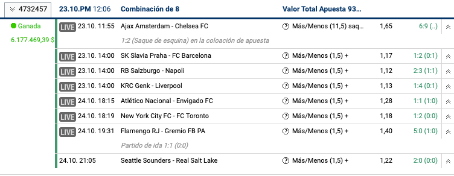

## INGENIERÍA DE SISTEMAS

## Trabajo grupal I

| Asignatura    | Valor         | Fecha |
| ------------- |:-------------:| -----:|
| Adminitración de base de datos avanzada | 10% |  **Octubre/19/2019** |

---
### Structure
Your repo should following the structure explained below, just to be more organized:

```
folder name
│   README.md
│
└───images
│   │__ image_01.png
│   │__ image_02.png
│
└───diagrams
│   │__ edr_diagram.pdf or png
│
└───scripts
    │__ script.sql
```

### Let's work!
1. Design (normalize) the problem below, add an Entity diagram class (Image).
2. Create 3 tablespaces:
    * Smallfile tablespace with 1Gb of data splited in 2 datafile. The name of the tablespace should be "BET_ITM".
    * Bigfile tablespace with 2Gb of data. The name of the tablespace should be "BET_AUDITING"
    * Undo tablespace with 500Mb and 1 datafile. (Set this tablespace to be used in the system)
3. Create the following Profiles with the resources described:
    1. **developer**
        * session per user: 1
        * connect time: 60
        * idle time: 30   
        * failed login attempts: 5
        * password life time: 90
    2. **web_application**
        * session per user: 5
        * connect time: no limit
        * idle time: no limit
        * failed login attempts: 2
        * password life time: 30
    3. **dba_admin**
        * session per user: 1
        * connect time: 30
        * idle time: no limit
        * failed login attempts: 2
        * password life time: 30
    4. **analyst**
        * session per user: 1
        * connect time: 30
        * idle time: 5
        * failed login attempts: 3
        * password life time: 30
        * password grace time: 3
    5. **support_III**
        * session per user: 1
        * connect time: 240
        * idle time: 5
        * failed login attempts: 3
        * password life time: 20
        * password grace time: 3
    6. **reporter**
        * session per user: 1
        * connect time: 90
        * idle time: 15
        * failed login attempts: 4
        * password life time: no limit
        * password grace time: 5
    7. **auditor**
        * session per user: 1
        * connect time: 90
        * idle time: 15
        * failed login attempts: 4
        * password life time: no limit
        * password grace time: 5
4. Roles and privileges:
    1. Explain what's the purpose of the **PUBLIC** role, which privileges has it and which users have this role?
    2. Explain the difference between these views: **DBA_SYS_PRIVS**, **DBA_TAB_PRIVS** and **DBA_ROLE_PRIVS**
    3. When we talk about privileges in Oracle, we find three main _categories_ of privileges, which are: **SYSTEM priveleges**, **OBJECT privileges** and **Privilege hierarchy**, define what is the purpose of each category and provide some examples of privileges which belong to each one of them.
    4. Create the following roles with the privileges required as follows:
        * **_To be defined_** ***
5. Users
    * Create 10 users
    * Each user should have a profile assigned from the ones created previously.
    * All of the profiles created should be used at least once.
    * All of the users should be able to login into the system
6. Create all the tables in the appropiate tablespace following the recommendations:
    * All of the tables should have a column named **id** which will be the primary key, even the tables resulting of the many to many associations should have this column.
    * Find an appropiate name for the tables resulting of the many to many associations, for instance, let's suppose we have a users table and a courses table, and is a many to many association, try to avoid a name like "usersxcourses".
    * Follow the naming conventions we talked about previously.
    * Use the appropiate type of column: date, datetime, varchar2, integer, etc.
    * Export all of the tables of both tablespaces using the dba user through Sql developer. **_More info will be provided later_**
7. Backups
    - Create two separate backups, one for the tablespace **BET_ITM** and another one for the tablespace **BET_AUDITING**. Take a screenshot of the console where the list of backups are shown.
9. Data:
    You should generate some CSV files in order to import to the tables (These files are going to be persisted into the repository):
    - Users: At least 500 users with its columns
    - Each user must have the limits for deposits
    - Matches: At least 100 matches, each match should have the quotes which will be generated randomly.
    - Bets: At least 1000 bets
    - Deposits: Each user should have at least one record describing how they get the money. 
10. Read the following articles and make a small talk or presentation talking about each of them:
    * [Top Redis Use Cases By Core Data Structure Types](http://highscalability.com/blog/2019/9/3/top-redis-use-cases-by-core-data-structure-types.html). For this article you should talk about the differences between Redis and other sql databases, preferred clients to use Redis, different types of data and their uses and companies which rely on Redis.
    * [Fallas graves en la seguridad de tarjetas de crédito y credenciales en Rappi](https://medium.com/advisability/tarjetas-credito-rappi-714e75166f7a). For this article you should talk about why Rappi was having issues with credit card's users information, how to store data of credit cards effectively, talk about what PCI DSS is and how you should handle information of credit cards; and finally lessons learned for your future projects and what you shouldn't do in order to protect your users.
    * [10 Reasons To Consider A Multi-Model Database](http://highscalability.com/blog/2015/3/4/10-reasons-to-consider-a-multi-model-database.html)
    * [Maybe Normalizing Isn't Normal
](https://blog.codinghorror.com/maybe-normalizing-isnt-normal/)
    * [Who Needs Stored Procedures, Anyways?](https://blog.codinghorror.com/who-needs-stored-procedures-anyways/)
11. Video:
    
    - Hacer un video en el cual se comparta la pantalla y se explique punto por punto lo que hicieron para resolver cada problema, ejecutarlos y hacer demostración de cada función, procedimiento y demás. En el punto de los artículo simplemente deben hablar sobre el mismo teniendo en cuenta las preguntas planteadas.
    - Todos los integrantes del equipo deberán hablar
    - NO USAR licencias de prueba o versiones "trial" ya que es ilegal, tener en cuenta la calidad del sonido y de video al momento de hacer el video, todos estos factores son tenidos en cuenta durante la calificación de mismo.
    - El software recomendado para hacer la grabación de los videos es https://obsproject.com/

### Problema

Casa de Apuestas "Bet ITM"

La casa de apuestas ha decidido poner en marcha la construcción de un producto a la altura de las exigencias del mercado, por esta razón usted y su equipo han sido encargados de diseñar la base de datos según las reglas de negocio, teniendo en cuenta dos premisas fundamentales. 1. El rendimiento de los queries. 2. La seguridad de los datos que son sensibles.

Inicialmente se exige validar que todas las transacciones sean hechas por personas mayores de edad identificadas con cédula de ciudadanía expedida en Colombia, todas las transacciones van a depender de los usuarios; el equipo de diseño ha comenzado a elaborar los bosquejos de la información necesaria a ser guardada y con base a las imágenes proveídas usted deberá guardar todo lo que se encuentre allí.

_**Importante:** La mesa directiva ha decidido implementar la estrategia de eliminación llamada "Soft deletion", es decir, ningún registro se eliminará de ninguna tabla, es decir, todas las tablas deberán tener una columna que identifique si el registro se encuentra "eliminado" o "disponible" [Soft deletion](https://www.quora.com/What-is-the-difference-between-soft-delete-and-hard-delete-in-SQL-Informatica-power-center-and-Informatica-cloud)_

1. #### Usuarios

    Cuando los usuarios se registran los datos mostrados a continuación son los requeridos para la inscripción: 
    Es importante mencionar que los usuarios para loguearse a la aplicación, necesitan hacerlo utilizando el documento de identidad y una contraseña segura. Por otro lado, los datos marcados con asterisco son campos obligatorios, y por ende deben tener su propia restricción en la base de datos utilizando __constraints__.
    En la siguiente imagen se encuentran las preferencias de usuario y algunos campos que no fueron incluídos inicialmente. 
    
2. #### Límites y Bloqueos

    Por ley, los usuarios tienen la posibilidad de establecer unos límites en los depósitos, apuestas. Es importante mencionar que cada vez que se cambia un límite se debe guardar la fecha y la hora con milisegundos cuando se realiza el cambio, con el fin de controlar que esos cambios sean efectivos después de una semana. Los montos no deben aceptar un valor de 0, si el usuario no tiene montos, los campos deben ser nulos, si el usuario desea limitar sus apuestas, debería existir el constraint para que acepte valores mayores a 0. 

3.  #### Apuestas

    Si bien es cierto que en la vida real se pueden apostar por diferentes deportes y modalidades, para el ejercicio académico, solo representeraremos las apuestas que tienen que ver con fútbol y las opciones de apuestas para cada partido serán fijas, con el fin de facilitar la normalización ya que no estamos trabajando con bases de datos no relacionales. Todas las apuestas tienen los siguientes estados:

    - **Abierta**: Boleto de apuesta / La selección no tiene ningún resultado y no ha sido encerrada
    - **Ganada**: Boleto de apuesta / La selección ha sido ganadora y se pagarán ganancias si es requerido
    - **Perdida**: Boleto de apuesta / La selección no ha sido exitosa y ha resultado perdedora
    - **Vendida**: El Boleto de apuesta ha sido vendido / “CashedOut” antes de conocerse el resultado final del evento
    - **Cancelada**: El Boleto de apuesta ha sido cancelado a través de la página web por el usuario o el evento ha sido pospuesto/abandonado
    - **Reembolsada**: Boleto de apuesta / La selección ha sido invalidada y anulada luego de que el resultado inicial fue aplicado
    - **Inválida**: Boleto de apuesta / La selección no es válida
    - **Rechazado**: El boleto de apuesta fue rechazado por los Traders después de que se envió una solicitud de apuesta, o la oferta ofrecida de los Traders fue rechazada por el cliente
    - **Pedido**: El boleto de apuesta se ha enviado a los Traders como una solicitud de apuesta y está a la espera de revisión / respuesta
    - **Parte-aprobada**: El boleto de apuesta enviado como una solicitud de apuesta no fue aceptado en su totalidad, pero los Traders han ofrecido un menor valor de apuesta

    Normalmente una apuesta luce de la siguiente manera: .

    En este caso el 1 representa Once Caldas y el 2 representa a Santa Fe. Una X significa empate. Las cuotas hay dos modalides, sin embargo, para este caso siempre serán en decimales que van desde el 1 hasta no tener límite. Por ejemplo en la apuesta que dice _"¿Ambos equipos anotarán gol?"_:

    - Si yo apuesto que "SI" y salgo ganador, la cuota es 2.2, significa que por cada peso será multiplicado 2.2 veces. Si yo apuesto 20.000 recibiré 44.000, si salgo perdedor pierdo los 20.000 apostados.
    - Si yo apuesto "NO" y salgo ganador, la cuota es 1.6. Si yo apuesto 20.000 recibiré 32.000
    
    

    Nota: El sistema deberá soportar las apuestas descritas en la imagen, en nuestro caso y para simplificar la estructuración, solamente habrán apuestas de fútbol y todos los partidos tendrán las mismas apuestas.

4. ### Depósitos
    
    El sistema soportará diversos medios de pago, cada medio de pago tiene unas condiciones descritas así:

    .

    * **Visa - Mastercard:** Mínimo: 20.000 COP - Máximo: 36.000.000 COP
    * **Baloto:** Mínimo: 18.000 COP - Máximo: 100.000.000 COP
    * **PSE:** Mínimo: 18.000 COP - Máximo: Sin límite
    * **Punto Red:** Mínimo: 1000 COP - Máximo: 1.000.000 COP
    * **Efecty:** Mínimo: 5.000 COP - Máximo: 100.000.000 COP
    * **Dimonex:** Mínimo: 5.000 COP - Máximo: 3.000.000 COP

    En el sistema deberá quedar registro de todos los depósitos que hagan los usuarios, deberá quedar registrado la fecha exacta (timestamp) en la que se realizó la transacción, el medio de pago, también deberá tener unos estados (PENDIENTE, EN PROCESO, RECHAZADA, EXITOSO) (Estos estados deberán tener validación por constraint).

    El sistema deberá soportar el saldo disponible de cada usuario conforme vayan realizándose depósitos.

5. ### Retiros
    
    El sistema deberá guardar las solicitudes de retiro que hagan los usuarios dependiendo de las ganancias, para esto se guardará la fecha exacta en la cual se hace la solicitud (timestamp), la fecha de desembolso, el banco y el número de cuenta al cual se realiza la consignación.

    También deberá tener una columna para validar si el cliente cumple o no con los requisitos para que el desembolso sea aprobado.

    Por motivos de seguridad, todos los clientes deben subir fotos con diversos comprobantes para evitar el fraude:

    - A) Factura servicios públicos con nombre y dirección.
    - B) Comprobante de Depósito
    - C) Identificación con nombre y fecha de nacimiento
    - D) Foto personal sosteniendo su documento de identificación legible.

    Para cada documento se deberá guardar el tamaño del archivo, la extensión y la url donde queda almacenada la imagen.

6. ### Auditoria
    
    En el tablespace "BET_AUDITING" deberá crearse la siguiente tabla:

    | Columnas    | 
    | ------------- |
    | Id |
    | Date and time |
    | Table |
    | record_id |
    | action (INSERT, UPDATE, DELETE) |
    | User |
    | IP |

---
    
## Trabajo grupal II

| Asignatura    | Valor         | Fecha |
| ------------- |:-------------:| -----:|
| Adminitración de base de datos avanzada | 10% / 20% |  **Noviembre/23/2019** |

_Tener en cuenta que el grupo que debe sustentar debemos definir la fecha de sustentación_

Todos los ajustes que deban hacer al modelo de normalización para soportar las funcionalidades requeridas, deberán ser persistidos, generar nuevamente el diagrama entidad relación (No excel, no diagramas hechos a mano, tampoco diagramas que no coincidan con las tablas reportadas). 

Por otro lado, deberán ajustar los datos para que sean lo más reales posibles, vamos a trabajar con menos datos, pero con mayor calidad, es decir, partidos programados, deberán cuidar las fechas de las apuestas y deberán insertar la información de tablas maestras o claves foráneas.

Los grupos que no crearon claves foráneas ni primarias deberán hacerlo.

1. ### Vistas:
    Crear las siguientes vistas:
    
    - Sumar el valor ganado de todas las apuestas de los usuarios que están en estado ganado que se efectuaron en el transcurso de la semana y mostrarlas ordenadas por el valor más alto; El nombre de la vista será "GANADORES_SEMANALES" y tendrá dos columnas: nombre completo y valor acumulado.
     
        Considerar el siguiente query `select trunc(sysdate, 'DAY') start_of_the_week, trunc(sysdate, 'DAY')+6 end_of_the_week from dual;`

        .

    - Nombre de la vista: DETALLES_APUESTAS. Esta vista deberá mostrar todos los detalles de apuestas simples que se efectuaron para un boleto en particular, tal como se muestra en el siguiente ejemplo:

        .

        La idea es que cuando se llame la vista se pueda pasar el id de la apuesta para que muestre los detalles de ese boleto en particular, ejemplo: `SELECT * FROM DETALLES_APUESTAS WHERE APUESTAS.ID = 123`

    - Nombre de la vista: RESUMEN_APUESTAS. Esta vista mostrará el resumen de cada apuesta efectuada en el sistema, la información de la siguiente imagen corresponderá a cada columna (Omitir la siguiente columna Pago máx.  incl. 5% bono (293.517,58 $)). La idea es que cuando se llame la vista, muestre la información únicamente de esa apuesta en particular: `SELECT * FROM RESUMEN_APUESTAS WHERE APUESTAS.ID = 123`. 

        .

    - Para la siguiente vista deberán alterar el manejo de sesiones de usuario, el sistema deberá guardar el timestamp de la hora de sesión y el timestamp del fin de sesión, si el usuario tiene el campo fin de sesión en null, significa que la sesión está activa. Crear una vista que traiga las personas que tienen una sesión activa, ordenado por la hora de inicio de sesión, mostrando las personas que más tiempo llevan activas; adicional, deberá tener una columna que calcule cuántas horas lleva en el sistema con respecto a la hora actual, la siguiente columna será la cantidad de horas seleccionada en las preferencias de usuario, finalmente, habrá una columna que reste cuánto tiempo le falta para que se cierre la sesión (si aparece un valor negativo, significa que el usuario excedió el tiempo en el sistema)

2. ### Trigger

    1.Crear un trigger para TODAS las tablas que tienen creadas, el trigger deberá llenar la información de la tabla de auditoría cuando se produce una INSERCIÓN, ACTUALIZACIÓN y ELIMINACIÓN de registros (Recordar que estamos trabajando con SOFT deletion y por ende ningún usuario debería tener el privilegio de ELIMINAR registros). Para obtener la IP desde donde se produce la conexión, usar: `SQL> SELECT SYS_CONTEXT('USERENV','IP_ADDRESS') FROM dual;`

3. ### Procedimientos almacenados
    
    1. Crear un procedimiento almacenado que reciba el nombre de la tabla y el id del registro que se desea actualizar, la idea de este procedimiento es que active el soft deletion de dicho registro ubicado en dicha tabla. Deberá tener manejo de excepciones dado el caso que el nombre de la tabla y/o el id no existan.
    2. Crear un procedimiento que coloque un partido en estado "FINALIZADO", en ese momento deberá calcular las ganancias y pérdidas de cada apuesta hecha asociada a ese partido.
    3. Crear un procedimiento que permita procesar el retiro de ganancias, recibirá el monto solicitado y el id del usuario, este procedimiento deberá insertar un registro en la tabla movimientos / retiros en estado "PENDIENTE", posteriormente deberá validar si el saldo es suficiente, si el usuario ha proveído toda la documentación exigida. También validará que si tenga una cuenta y un banco válido registrado. Si todo se valida sin problemas, deberá colocar el estado "APROBADO" en el registro correspondiente y deberá restar del saldo disponible el valor retirado. Si el procedimiento falla alguna validación, el estado pasará a "RECHAZADO". El sistema deberá almacenar cuál es la novedad por la cual se rechazó (Ya ustedes deciden si crean una nueva tabla, o colocan en la tabla de retiros una columna de observaciones).
    4. Crear un procedimiento que permita realizar un depósito, similar al procedimiento anterior, deberá validar los posibles casos para que se apruebe / se rechace esta transacción. Ejemplo, validar los montos mínimos y máximos para cada medio de pago. Si hay alguna novedad guardar el motivo por el cual fue rechazado. El sistema deberá validar los límites de depósitos para cada usuario.
    5. Crear un procedimiento almacenado que invoque la vista de sesiones activas y marque el campo fin de sesión en null.

4. ### Artículos

    Leer los siguientes artículos / ver video:

    * [The Problem with Time & Timezones - Computerphile
](https://www.youtube.com/watch?v=-5wpm-gesOY)
    * [Netflix: What Happens When You Press Play?](http://highscalability.com/blog/2017/12/11/netflix-what-happens-when-you-press-play.html)
    * [Why Uber Engineering Switched from Postgres to MySQL
](https://eng.uber.com/mysql-migration/)
